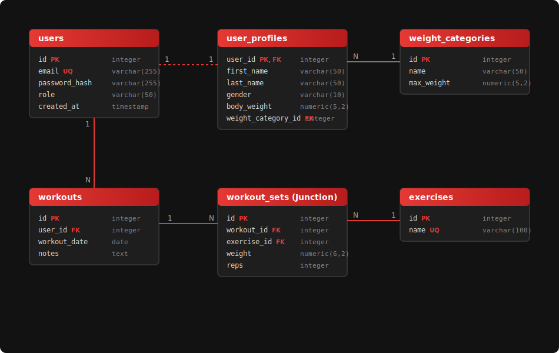
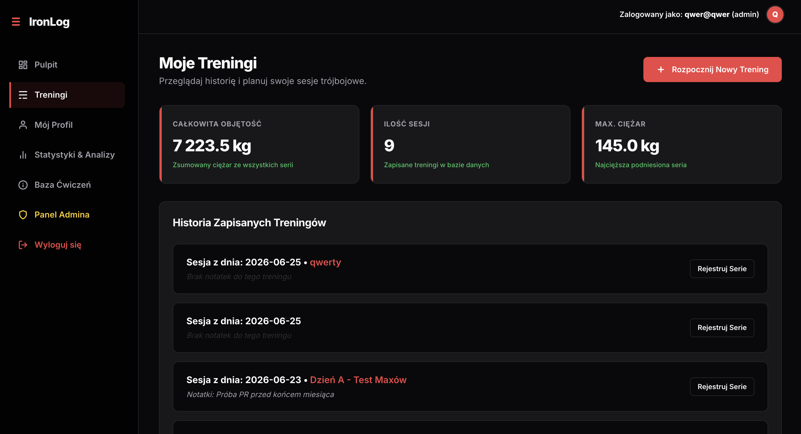
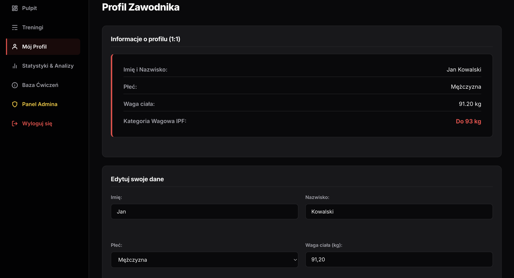
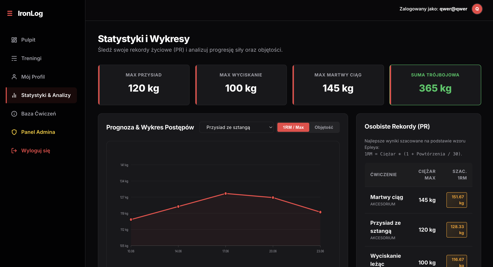
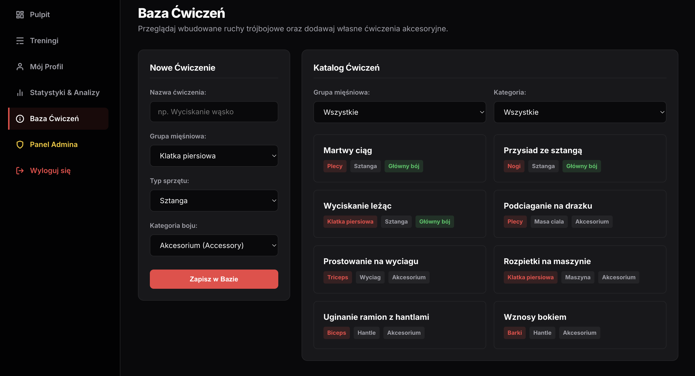
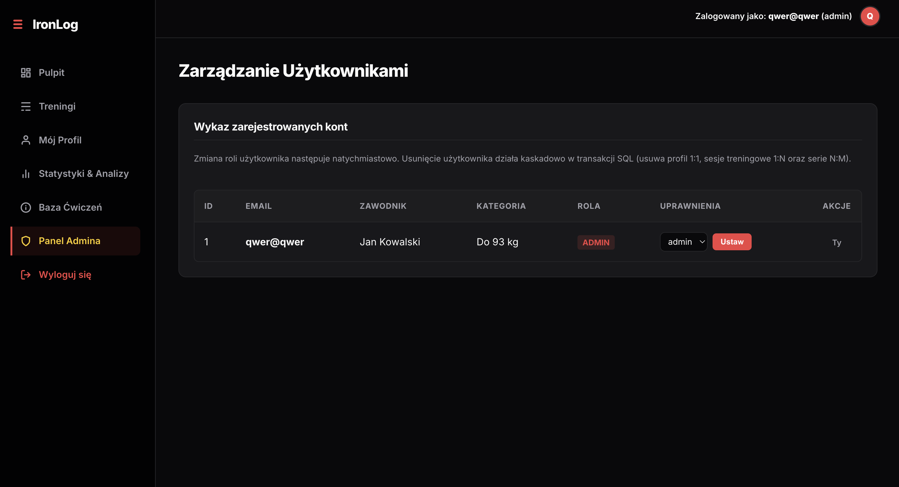
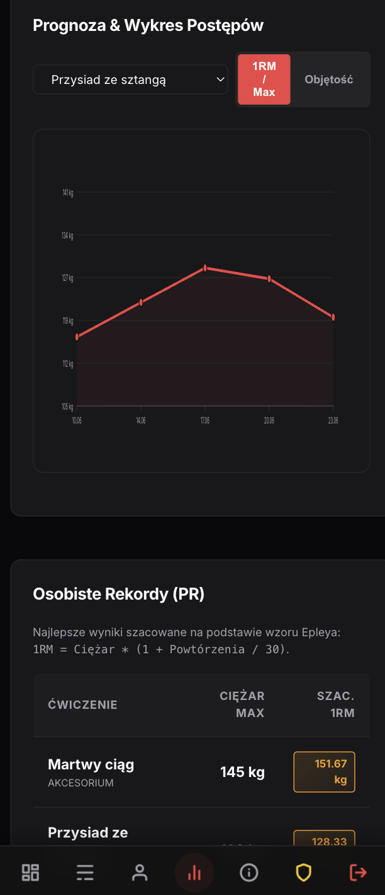
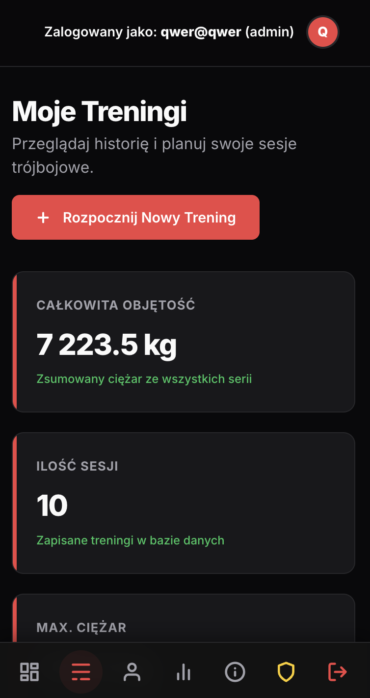

# Aplikacja do Śledzenia Postępów Treningowych (Trójbój Siłowy)

Projekt internetowej aplikacji służącej jako dziennik treningowy dla zawodników trójboju siłowego (przysiad, wyciskanie leżąc, martwy ciąg). Aplikacja uwzględnia oficjalne kategorie wagowe IPF i oferuje zaawansowane mechanizmy bazodanowe, asynchroniczny interfejs oraz bezpieczne mechanizmy autoryzacji i ról.

---

## 🛠️ Zastosowane Technologie
* **Backend:** PHP 8.2 (Czysty obiektowy, SOLID, strict MVC z Front Controllerem i Routerem)
* **Baza Danych:** PostgreSQL 15 (Docker)
* **Frontend:** Czysty HTML5, CSS3 (zmienne, Media Queries - pełne RWD, tryb Dark Mode) oraz JavaScript (Fetch API do asynchronicznej komunikacji)
* **Środowisko:** Docker / Docker Compose
* **Testy:** PHPUnit (testy jednostkowe) + skrypt Bash/curl (testy integracyjne)

---

## 📂 Architektura Aplikacji
Aplikacja została zbudowana na autorskim, czystym wzorcu **MVC (Model-View-Controller)** bez użycia zewnętrznych frameworków.

### Diagram warstwowy architektury:
```
+-------------------------------------------------------------------+
|                           PREZENTACJA                             |
|    Widoki HTML5 / CSS3 (zmienne, RWD) / Asynchroniczny JS (Fetch) |
+-------------------------------------------------------------------+
                                 |  (Fetch / POST / GET)
                                 v
+-------------------------------------------------------------------+
|                        KONTROLER (MVC)                            |
|    Front Controller (index.php) -> Router -> Controllers          |
|    (AuthController, ProfileController, WorkoutController, etc.)   |
+-------------------------------------------------------------------+
                                 |  (Komunikacja z modelami)
                                 v
+-------------------------------------------------------------------+
|                          MODEL (MVC)                              |
|    Baza klasy Model (Singleton PDO) -> Modele (User, Workout...)  |
+-------------------------------------------------------------------+
                                 |  (Zapytania SQL / Transakcje)
                                 v
+-------------------------------------------------------------------+
|                    BAZA DANYCH (PostgreSQL)                       |
|    Tabele 3NF / Relacje (1:1, 1:N, N:M) / Widoki / Wyzwalacze     |
+-------------------------------------------------------------------+
```

---

## 📊 Diagram ERD Bazy Danych
Diagram bazy danych przedstawia pełną strukturę relacyjną w 3NF, w tym relacje 1:1, 1:N oraz N:M (tabela złączeniowa `workout_sets`).



> 💡 **Wskazówka:** Plik [erd.svg](erd.svg) można bezpośrednio zaimportować i edytować w edytorze [draw.io](https://app.diagrams.net).

---

## 🚀 Instrukcja Uruchomienia

### Wymagania wstępne:
* Docker oraz Docker Compose zainstalowane na systemie.

### Krok po kroku:
1. Skopiuj plik z przykładowymi zmiennymi środowiskowymi do pliku produkcyjnego:
   ```bash
   cp src/.env.example src/.env
   ```
2. Uruchom kontenery w tle:
   ```bash
   docker-compose up -d
   ```
3. Aplikacja będzie dostępna w przeglądarce pod adresem:
   **[http://localhost:8080](http://localhost:8080)**

---

## 🔐 Zaawansowane SQL w Bazie Danych

Baza spełnia rygorystyczne wymagania projektowe:
* **Relacje:**
  * **1:1:** Powiązanie `users` z `user_profiles` za pomocą klucza `user_id`.
  * **1:N:** Powiązanie `users` z `workouts`.
  * **N:M:** Powiązanie `workouts` z `exercises` poprzez tabelę asocjacyjną `workout_sets`.
* **Widoki:**
  * **`user_training_stats`**: Łączy 5 tabel i wyznacza statystyki sumaryczne użytkowników (objętość treningowa, rekordy ciężaru, ilość treningów).
  * **`exercise_records`**: Złącza tabele w celu wyznaczenia rekordów osobistych (PR) użytkowników dla konkretnych ćwiczeń.
  * **`workout_summaries`**: Nowy widok złączający tabele w celu generowania zagregowanych podsumowań każdego treningu (objętość, liczba ćwiczeń, najlepszy wynik).
  * **`user_exercise_personal_records`**: Nowy widok złączający tabele w celu pobierania osobistych rekordów (max ciężar i max 1RM) per użytkownik i ćwiczenie.
* **Funkcje bazodanowe (FUNCTION):**
  * **`determine_weight_category()`**: Wyznacza odpowiednią kategorię wagową IPF na podstawie wagi ciała.
  * **`calculate_epley_1rm(weight, reps)`**: Dynamicznie wylicza szacowany 1RM (maksimum na jedno powtórzenie) na podstawie wzoru Epleya.
* **Wyzwalacze (TRIGGER):**
  * **`trigger_determine_weight_category`**: Automatycznie przypisuje kategorię wagową przy wstawianiu lub edycji profilu użytkownika.
  * **`trigger_mark_pr`**: Uruchamiany przed wstawieniem serii do tabeli `workout_sets`. Automatycznie sprawdza, czy nowa seria bije dotychczasowy rekord szacowanego 1RM użytkownika dla danego ćwiczenia i, jeśli tak, oznacza typ serii (`set_type`) jako `pr`.
* **Transakcje bazodanowe:** Zastosowane przy rejestracji użytkownika (jednoczesne bezpieczne dodanie konta i profilu 1:1) oraz usuwaniu konta (zabezpieczenie spójności).

---

## 🧪 Scenariusz Testowy (Krok po kroku)

### 1. Rejestracja i logowanie (Utrzymanie sesji)
* Przejdź do `/register`, wprowadź dane i zarejestruj się.
* Przejdź do `/login`, zaloguj się. W sesji zostaną zapisane Twoje dane i przypisana domyślna rola (`user`).

### 2. Edycja Profilu (1:1 i Wyzwalacz bazy)
* Przejdź do zakładki **Mój Profil** (`/profile`).
* Wprowadź swoje imię, nazwisko i wagę (np. `82.5` kg).
* Zapisz zmiany. Zauważ, że pole **Kategoria Wagowa** zostało automatycznie wyliczone przez wyzwalacz bazy danych jako **Do 83 kg**. Zmień wagę na `92` kg – kategoria automatycznie zaktualizuje się na **Do 93 kg**.

### 3. CRUD i asynchroniczny Fetch API (Treningi i Serie)
* Przejdź do **Moje Treningi** (`/workouts`) i kliknij **Dodaj nowy trening** (`/workouts/create`).
* Wprowadź nazwę treningu, datę i kliknij zapisz. Zostaniesz przekierowany do szczegółów treningu (`/workout?id=X`).
* Wybierz ćwiczenie (z katalogu). Zauważ sekcję **Poprzedni trening (Historia w locie)** – asynchronicznie załaduje ona Twoje serie z ostatniej sesji tego ćwiczenia, pomagając zaplanować aktualną sesję!
* Dodaj nową serię (np. Martwy ciąg, 150 kg, 5 powtórzeń, RPE 9, Typ serii: Normalna). Seria zostanie dodana **asynchronicznie (Fetch API)** – pojawi się w tabeli i odświeży podgląd historii bez przeładowania całej strony!
* Kliknij przycisk **Usuń** przy danej serii. Seria zostanie usunięta asynchronicznie, a wiersz zniknie z tabeli.

### 4. Wykresy Postępów i Rekordy (Analizy)
* Przejdź do podstrony **Statystyki & Analizy** (`/analytics`).
* Zobacz podsumowanie swoich maksymalnych wyników w bojach trójbojowych oraz sumę trójbojową.
* W sekcji wykresu wybierz ćwiczenie z listy rozwijanej. Asynchronicznie załaduje się interaktywny wykres liniowy (wygenerowany dynamicznie w czystym SVG przez JS) przedstawiający progresję 1RM lub całkowitej objętości treningowej w czasie.
* Zobacz tabelę z osobistymi rekordami (PR) generowaną w oparciu o widok bazodanowy `user_exercise_personal_records`.

### 5. Uprawnienia użytkowników (Role i Panel Admina)
* Użytkownik o domyślnej roli (`user`) nie ma dostępu do panelu administratora. Wejście pod `/admin/users` z poziomu konta użytkownika wyświetli dedykowaną stronę błędu **403 Brak uprawnień**.
* Przejdź do bazy danych lub zaloguj się na domyślne konto administratora:
  * **Email:** `qwer@qwer`
  * **Hasło:** `qwer`
* Jako administrator zobaczysz w nagłówku link **Panel Admina** (`/admin/users`).
* W panelu admina możesz zmieniać role innych użytkowników (z `user` na `admin` i odwrotnie) oraz usuwać ich konta (akcja kaskadowa `ON DELETE CASCADE` automatycznie usunie ich profile, treningi oraz serie).

### 6. Globalna obsługa błędów
* Wpisanie nieistniejącego adresu (np. `/nieistnieje`) wyświetli dedykowaną stronę **404 Nie znaleziono strony**.
* Próba wywołania akcji bez autoryzacji wyświetli stronę błędu lub przekieruje na logowanie.

---

## 🖼️ Zrzuty Ekranu Aplikacji (Screenshots)

### Wersja Desktopowa (Komputerowa)

1. **Pulpit (Dashboard):** Ekran główny prezentujący oficjalne kategorie wagowe IPF oraz szybki start dla zalogowanego zawodnika.
   

2. **Dziennik Treningowy (Lista):** Przejrzysty spis dotychczas zrealizowanych sesji treningowych z możliwością dodawania nowych.
   

3. **Kreator Treningu (Szczegóły):** Zaawansowany moduł do asynchronicznego logowania serii (waga, powtórzenia, RPE, typ serii) z czasem odpoczynku i historią w locie.
   

4. **Wykresy i Statystyki:** Interaktywny wykres postępów (szacowany 1RM / objętość) generowany dynamicznie w SVG oraz tabela rekordów życiowych (PR) pobierana z widoku bazodanowego.
   

5. **Baza Ćwiczeń (Katalog):** Wygodna wyszukiwarka ruchów trójbojowych i akcesoryjnych z filtrowaniem po kategoriach i grupach mięśniowych.
   

### Wersja Mobilna (Smartfony - Responsywność RWD)

Aplikacja mobilna posiada **podążający dolny toolbar (pasek nawigacji) z ikonami SVG**, co zapobiega ucinaniu linków i przypomina natywną aplikację.

6. **Pulpit mobilny:** Ekran główny z dopasowaną siatką kafelków i dolnym toolbarlem na telefonie komórkowym.
   

7. **Kreator Treningu Mobilny:** Dziennik i logowanie serii dopasowane do wąskich ekranów.
   

---

## 🚦 Uruchamianie Testów

### 1. Testy Jednostkowe (PHPUnit)
Uruchom testy jednostkowe klas `Config`, `Router` oraz `Exercise` wewnątrz kontenera:
```bash
docker exec powerlifting_web php /var/www/html/phpunit.phar --bootstrap /var/www/html/tests/bootstrap.php /var/www/html/tests
```

### 2. Testy Integracyjne (Bash + curl)
Uruchom zewnętrzny skrypt testów integracyjnych badający kody statusów HTTP dla endpointów:
```bash
./run_integration_tests.sh
```

---

## 🔒 Security Bingo (Bezpieczeństwo Aplikacji)

Aplikacja została zabezpieczona przed najczęstszymi podatnościami bezpieczeństwa (OWASP Top 10):

* **SQL Injection (SQLi):** Wszelkie operacje bazodanowe są realizowane przy użyciu parametrów bindowanych (`prepare` i `execute`) w bibliotece PDO. W kodzie nie występuje bezpośrednie łączenie ciągów znaków (SQL string concatenation) z danymi użytkownika.
* **Cross-Site Scripting (XSS):** Wszelkie dane wprowadzane przez użytkownika są zabezpieczane przed wyświetleniem za pomocą funkcji `htmlspecialchars()` (funkcja formatowania wywoływana w widokach chroni przed wykonywaniem wstrzykniętego kodu JS w przeglądarce).
* **Bezpieczne haszowanie haseł:** Do szyfrowania haseł użytkowników wykorzystywana jest silna, asymetryczna funkcja kryptograficzna `password_hash()` z algorytmem **bcrypt** (domyślnym w PHP 8.2), a logowanie opiera się na bezpiecznej weryfikacji przez `password_verify()`.
* **Utrzymanie sesji i autoryzacja:** Stan zalogowania użytkownika jest zapisywany w bezpiecznej sesji PHP (`session_start()`). Po wylogowaniu sesja jest całkowicie niszczona (`session_destroy()`).
* **Kontrola Dostępu (Broken Access Control):** Kontrolery (np. `AdminController`, `WorkoutController`, `AnalyticsController`) weryfikują tożsamość użytkownika na poziomie konstruktora lub metod akcji. Próba dostępu do cudzych treningów lub tras administratora bez uprawnień wywołuje wyjątek globalnie przechwytywany i zwraca stronę błędu **403 Forbidden** lub **401 Unauthorized**.
* **Integralność i transakcyjność bazodanowa:** Transakcje SQL o odpowiednim poziomie izolacji dbają o zachowanie spójności bazodanowej przy rejestracji użytkownika oraz usuwaniu kont.

---

## 📋 Checklista Zrealizowanych Wymogów
- [x] Środowisko Docker (PHP 8.2 + Apache, PostgreSQL 15).
- [x] Brak frameworków, brak gotowych szablonów. Wszystko od zera.
- [x] Architektura Strict MVC (Front Controller, Router, PSR-4 Autoloader).
- [x] Bezpieczna autoryzacja (PHP Session, `password_hash`, `password_verify`).
- [x] Podział na role użytkowników (`user`, `admin`) weryfikowane przez system.
- [x] Panel administratora (CRUD użytkowników, zmiana ról, usuwanie kont).
- [x] Baza danych w 3NF (klucze obce z akcjami referencyjnymi ON DELETE, ON UPDATE).
- [x] Relacje w bazie danych: 1:1, 1:N oraz N:M.
- [x] Minimum 2 widoki bazodanowe (złączenia wielu tabel).
- [x] Wyzwalacz (TRIGGER) oraz funkcja bazodanowa (FUNCTION) przeliczająca kategorie wagowe.
- [x] Zastosowanie bezpiecznych transakcji bazodanowych.
- [x] Asynchroniczna obsługa serii treningowych za pomocą Fetch API (dodawanie/usuwanie).
- [x] Estetyczny design, responsywność (Media Queries) i tryb ciemny (Dark Mode).
- [x] Globalna obsługa błędów (strony 400, 401, 403, 404, 500).
- [x] Testy jednostkowe (PHPUnit) oraz integracyjne (Bash/curl).
- [x] Dokumentacja (README.md, ERD SVG, zmienne środowiskowe .env.example, scenariusz testowy).
- [x] Systematyczna praca dokumentowana regularnymi commitami w Git.
